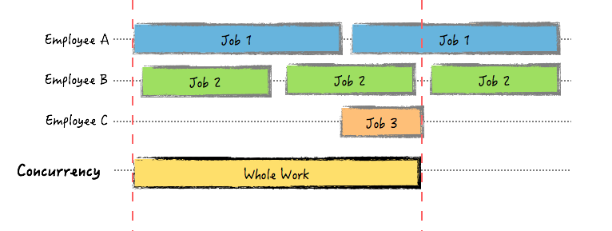
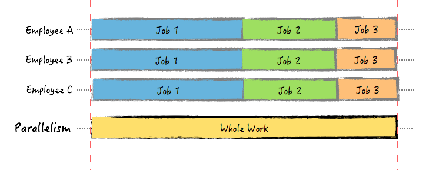

## Concurrency
Benefits Of Go's Concurrency Model
- fast
- concurrent
- replicated
- robust

### What Is Concurrency?
Concurrency is the composition of independently executing computations.

Concurrency is a way to structure software, particularly as a way to write clean code that interacts well with the real world.

### Concurrency Is Not Parallelism
- Concurrency is about dealing with a lot of things at once. 

- Parallelism is about doing a lot of things at once.

***If you have only one processor, your program can still be concurrent but it cannot be parallel.*** 

### Goroutines
**goroutine** is an independant function, launched by a go statement, capable of being run concurrently with other goroutines  
A goroutine is ***NOT*** a system thread.

### Goroutine Characteristics
- common to have hundreds, thousands, even millions of goroutines
- have their own call stack, which grows and shrinks as required
- they require only a few bytes of memory
- there might be only one thread in a program with thousands of goroutines

### The Go Scheduler
The scheduler in Go is responsible to distribute the runnable goroutines over multiple worker OS threads that run on one or more processors.

It does this by **work-sharing** and **work-stealing**.

- **Work-sharing**: When a processor generates new threads, it attempts to migrate some of them to the other processors with the hopes of them being utilized by the idle/underutilized processors.
- **Work-stealing**: An underutilized processor actively looks for other processor’s threads and “steal” some.

### Channels
Channels are a great way to communicate in Go.    
You can think of channels as pipes that connect concurrent goroutines. You can send values into a channel from one goroutine, and receive those values in another goroutine.

### Sync Package
The [sync package](https://golang.org/pkg/sync/) contains many of the primitive building blocks needed to synchronize communication across goroutines.

### Data Races
Race conditions are among some of the most difficult bugs to find and fix. It happens when one or more goroutine reads and writes to the same memory space.